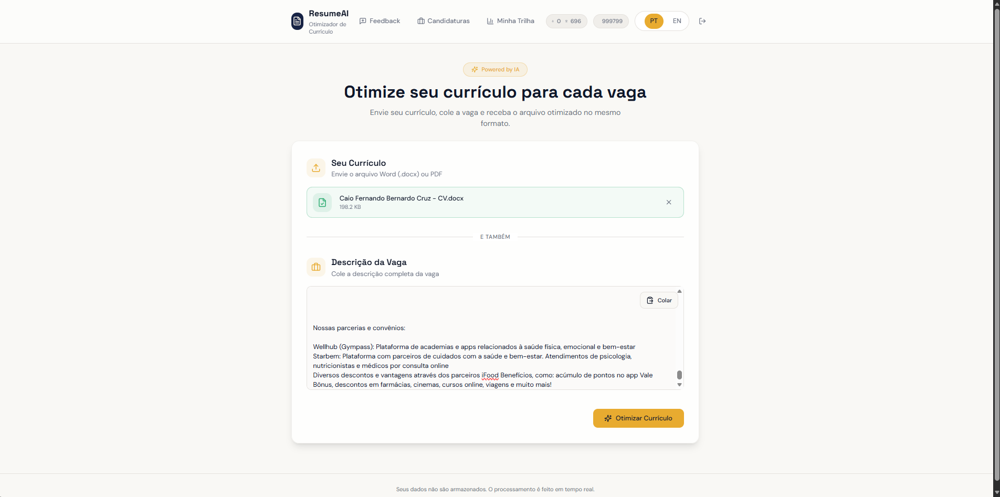
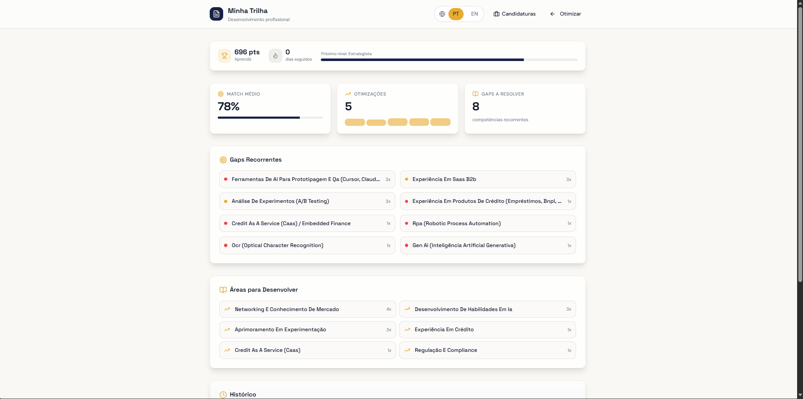
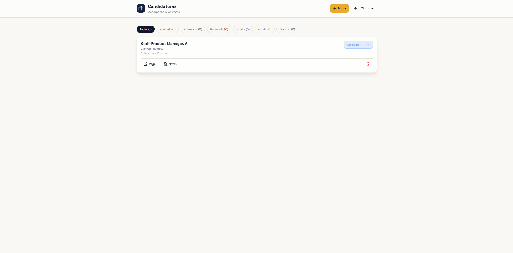

# CV Ninja 🥷

> Ajuste inteligente de currículo para cada vaga: a IA adapta seu CV à descrição da vaga, em português e inglês, com download em PDF.

## O problema

Recrutadores (e os robôs de ATS) descartam currículos genéricos em segundos. Adaptar o CV para cada vaga funciona, mas ninguém tem tempo de reescrever o currículo 30 vezes.

## A solução

O CV Ninja recebe seu currículo e a descrição da vaga, e a IA reescreve o CV destacando exatamente o que aquela vaga pede, mantendo a verdade do seu histórico, em **PT ou EN**, pronto para baixar em PDF.

## Funcionalidades

- **Ajuste por vaga**: cole a descrição, receba o CV otimizado com match score e gaps de competência
- **Minha Trilha**: gamificação do desenvolvimento profissional — pontos, nível, match médio entre otimizações e mapa dos gaps que mais se repetem entre as vagas aplicadas
- **Candidaturas**: kanban de status por vaga (aplicada, entrevista, oferta, recusada, aceita, desistiu), com link da vaga e notas
- **Bilíngue**: português e inglês, preservando a formatação original do currículo
- **Export em PDF** com formatação profissional
- **Cobrança por consumo**: integração de pagamentos e página de planos para quem passa do uso gratuito
- **IA como copiloto**, não inventora: realça o que você já tem, não inventa experiência

## Stack

`IA (LLM)` `React` `TypeScript` `Supabase` `Geração de PDF` `Pagamentos`

## Status

🚧 Em evolução: modelo de precificação por consumo em definição.

> 🔒 Este repositório é a vitrine do produto. O código-fonte é privado.

---

Feito por [Caio Cruz](https://github.com/CaiioFe) · [iacaio.com.br](https://iacaio.com.br)
